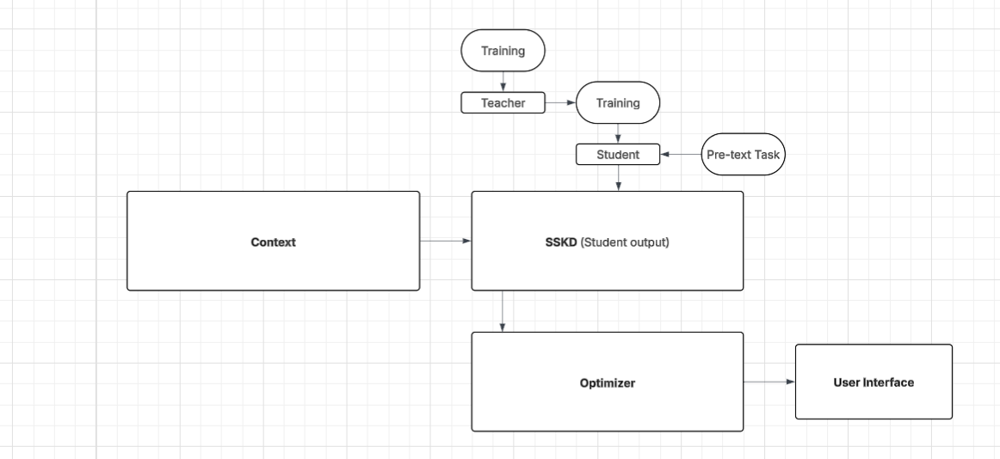

# Running the Code
## Requirements
I ran this code on Windows with Python 3.8.0, torch 1.13.1, torchvision 0.14.1

```pip install torch==1.13.1+cu117 torchvision==0.14.1+cu117 -f https://download.pytorch.org/whl/cu117/torch_stable.html```

## Running

### Teacher Training
An example of teacher training is:
```
python teacher.py --arch wrn_40_2 --lr 0.05 --gpu-id 0
```
where you can specify the architecture via flag `--arch`

You can also download all the pre-trained teacher models [here](https://drive.google.com/drive/folders/1vJ0VdeFRd9a50ObbBD8SslBtmqmj8p8r?usp=sharing).
If you want to run `student.py` directly, you have to re-organise the directory. For instance, when you download *vgg13.pth*, you have to make a directory for it, say *teacher_vgg13*, and then make a new directory *ckpt* inside *teacher_vgg13*. Move the *vgg13.pth* into *teacher_vgg13/ckpt* and rename it as *best.pth*. If you want a simpler way to use pre-trained model, you can edit the code in `student.py` (line 90).

### Student Training
An example of student training is:
```
python student.py --t-path ./experiments/teacher_wrn_40_2_seed0/ --s-arch wrn_16_2 --lr 0.05 --gpu-id 0
```
The meanings of flags are:
> `--t-path`: teacher's checkpoint path. Automatically search the checkpoint containing 'best' keyword in its name.

> `--s-arch`: student's architecture.

All the commands can be found in `command.sh`

# ADAPTIVE USER INTERFACES (AUIs)
### --- Information that you are already semi-aware of if not tired of hearing

AUIs are a relatively new paradigm within Human-Computer Interaction. The idea is simple -- 
feed context information into a system that makes decisions and allow it to make 
changes to interfaces in real time. I work with Augmented/Virtual Reality (AR/VR) technology with a focus on Augmented Reality. 
The interfaces in AR/VR are different than the interfaces used traditionally on a desktop or mobile device. 
In AR/VR, the interfaces are 3D User Interfaces as opposed to 2D User interfaces. 
Not only that, but the context that AR/VR interfaces are used in is fundamentally different. Particularly with Augmented Reality, 
the context is not just the actions the user takes but also the real world around the user. It is impossible to ask a developer to account for this context.
Take a bottle of hand sanitizer for example. What do you do with Sanitizer? Well, it's used for cleaning hands. What else?
Well, the bottle might be round or square but that information is superficial and tells us nothing about the sanitizer itself.

One thing that I personally forgot when considering sanitizer is that it is flammable. This means that it is harmful to someone. 
Additionally, you don't quite want to drink it either so it is also toxic. 

# Making the jump from traditional computing to adaptive computing
Adaptivity has a certain standard that must be met. As per the seminal paper by Salehie and Tahvildari (though, paraphrased), 
the system must first be capable of making decisions. 
The system must be able to act autonomously. The system must be capable of doing both independently and without developer input. 

An example of a system that seems adaptive at first glance but is really more of a hybrid "In-between" model. 
It has a model of concepts, their properties, and their relationships among specific domains -- otherwise known as an ontology model. 
It has some sort of reasoner that determines things based on this model. And then, as developers, we can do things with the information the reasoner returns.
This is the setup that I have for the adaptive user interfaces module in FirstModulAR. In this project, what we do with the information the reasoner returns 
is pass it on to a brute-force subset search algorithm that determines, based on weights, how closely related a semantic relationship is to an interaface. 


### --- New Information

Some problems with this approach. I am the one who made the ontology model used and I am most certainly not able as a developer to determine everything about everything.
I am the one who decided the weights used in the combinatorial optimization step which is really just one giant and complicated `if` statement when you break it down. 
This system is, most importantly ```not adaptive```. It does not make decisions independent of my input. We need something that can determine information that is not obvious to a developer 
or immediately obvious to any given person looking at the world. It must be capable of taking in large amounts of context. It must also be able to extract hidden information and assign a weight to it.

# SSKD for FMAR

This is where I'm going to start writing a little more candidly. SSKD seems to me to be a great first step in altering our approach from dynamic programming to truly adaptive programming.

Here is the revised model including SSKD which replaces both the ontology and reasoner with soft labels.


Additionally, here is the current study design for the FMAR adaptive module.


# SSKD Class Project
The first step we need to determine in an implementation for a potential future FMAR study design is determining an optimal pre-text task. My goal for this 
class is two-fold:
- Determine if pre-text task affects model performance
- - Determine how to measure model performance as impacted by task
- Determine if a universal pre-text task exists
- - ~~Cry if not~~
- - If no universal pre-text task exists, determine a way to create optimized tasks for universal inputs based on the final goal of the model

Then, I will attempt a soft-implementation of this model into the FMAR architecture as described above.